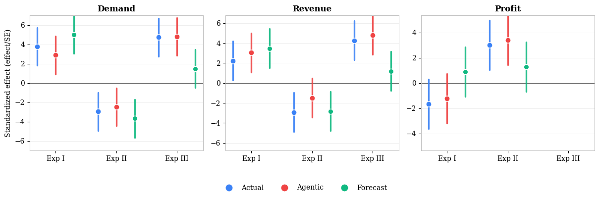

# tobias huelden — personal homepage

A single-file static homepage (no build system, no dependencies).

## Files

- `index.html` — the entire site (HTML, CSS, JS in one file)
- `portrait.jpg` — sidebar photo (referenced by index.html; keep them together)
- `figs/` — put paper figures here (see "Adding figures" below)
- `papers/` — put PDFs here (CV, extended abstract)
- `.nojekyll` — tells GitHub Pages to serve files as-is

## Deploy to GitHub Pages

1. Create a new repository on GitHub named exactly:
   `<your-username>.github.io`
   (public, no template, no README needed)

2. Upload the contents of this folder to the repository root
   (via the web UI: "uploading an existing file", drag everything in;
   or via git:)

   ```
   git init
   git add .
   git commit -m "homepage"
   git branch -M main
   git remote add origin git@github.com:<your-username>/<your-username>.github.io.git
   git push -u origin main
   ```

3. In the repo: Settings → Pages → Source: "Deploy from a branch",
   Branch: `main`, folder `/ (root)`. Save.

4. After ~1 minute the site is live at:
   `https://<your-username>.github.io`

Any later change: edit the file, commit, push — the site updates itself.

### Optional: custom domain

Settings → Pages → Custom domain (e.g. `tobiashuelden.de`), then add the
DNS records GitHub shows you at your domain registrar. Keep
"Enforce HTTPS" ticked.

## Remaining placeholders (search index.html for `href="#"`)

- CV link ("My CV is here") → e.g. `papers/cv.pdf`
- LinkedIn link → your profile URL
- Photography link ("favourite photos are here") → your photography site
- Master's thesis: "Extended abstract ↗" → e.g. `papers/thesis-extended-abstract.pdf`
- Chicago Booth: two "Read the paper ↗" links → Prof. Weber's paper pages (or remove)
- Climate & Weather: "Draft available on request" → mailto or leave as text

## Adding abstracts

Each project has a panel with `[Abstract] Paste the abstract here…` —
replace that text with the real abstract.

## Adding figures

In each panel there is a commented-out image line:

```html
<!--  -->
<div class="fig-ph">Add the most relevant figure</div>
```

Put the figure file in `figs/`, uncomment the `` line (fix the
filename), and delete the `<div class="fig-ph">…</div>` placeholder line.
Update the `[Caption]` text below it. PNG or JPG, ~1000px wide is plenty.

## Notes

- The display name uses "Hülden"; the meta description also contains
  "Huelden" so both spellings are found by search engines.
- Preprints policy encoded in the page: papers link out only once they
  are public on arXiv/SSRN; in-progress work shows
  "Preprint in preparation".
